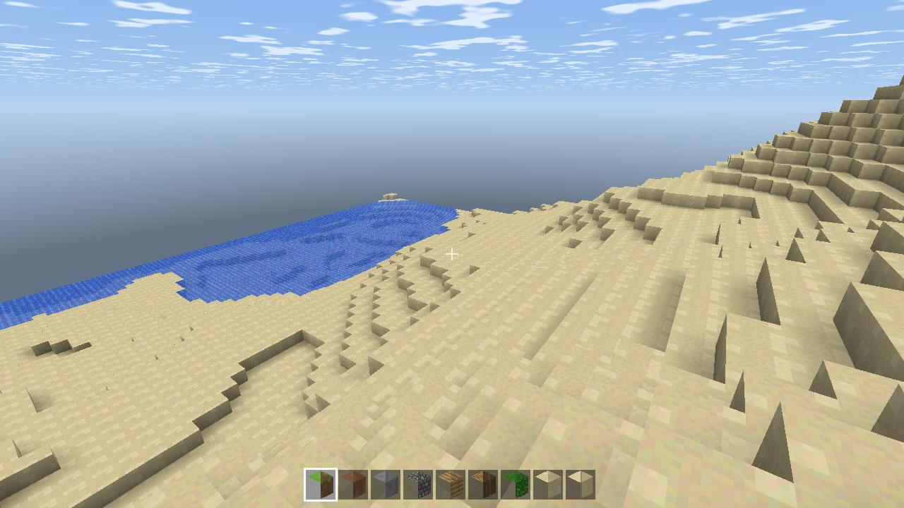
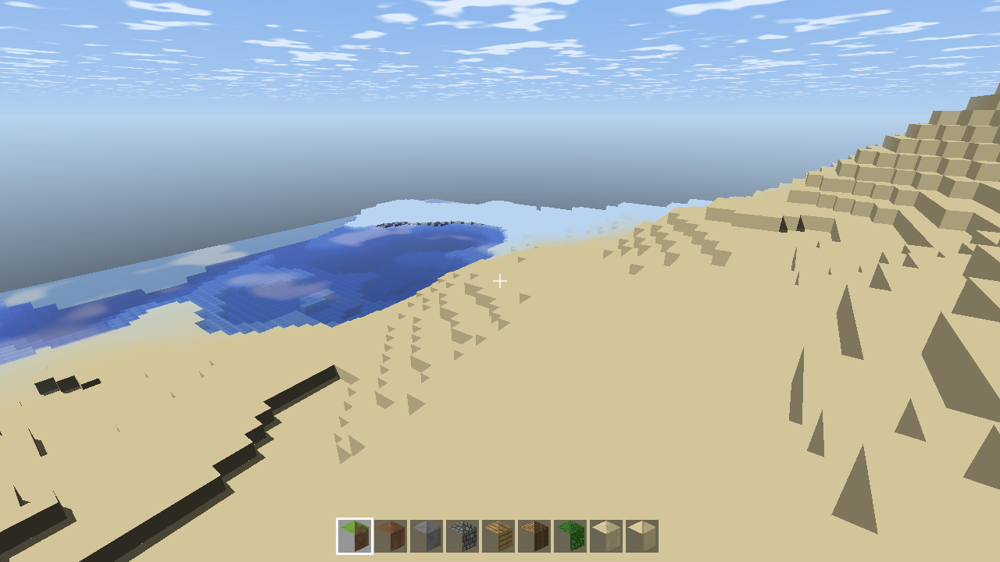

# Minecraft Clone (Python)

A Minecraft clone written in Python, featuring three rendering backends: OpenGL rasterization, Vulkan (wgpu) rasterization, and a GLSL voxel DDA ray tracing mode.

| OpenGL | Vulkan | Ray Tracing |
|--------|--------|-------------|
|  |  |  |

## Running

```bash
pip install -r requirements.txt
python -m minecraft                    # OpenGL renderer (default)
python -m minecraft --renderer vk      # Vulkan renderer (wgpu)
python -m minecraft --renderer rt      # Ray tracing (GLSL voxel DDA)
```

Requires a GPU with OpenGL 3.3 Core support; Vulkan mode requires a Vulkan driver (supported via wgpu; on Windows either DX12 or Vulkan works, preferring the high-performance adapter).

## Controls

| Key | Action |
|-----|--------|
| W A S D | Move |
| Mouse | Look around |
| Space | Jump / ascend while flying / swim up |
| Shift | Descend while flying |
| Ctrl | Sprint |
| F | Toggle flight |
| Left click | Break blocks (holdable) |
| Right click | Place blocks (holdable) |
| Middle click | Pick the block under the crosshair |
| 1-9 / Scroll wheel | Switch hotbar slot |
| Esc | Release mouse / quit |

On exit, the world is automatically saved to `saves/world_<seed>.npz`. The next time you start with the same seed, it will be loaded automatically (player position, camera angles, hotbar, in-game time, all generated chunks, and block modifications are preserved). Use `--fresh` to ignore the save and start over.

## Command Line Arguments

```
--seed N        World seed (default 20260731)
--renderer      gl | rt | vk
--pos "x,y,z"   Set spawn position
--yaw --pitch   Initial camera angles (radians)
--time T        Initial time [0,1); 0.32 is morning, 0.55 is night
--rd N          Render distance (chunks, default 8)
--fresh         Ignore existing save
--save          Enable saving/loading even in screenshot mode
--screenshot P  Headless screenshot mode: run for --frames frames, save screenshot, then exit
--frames N      Screenshot mode frame count (default 60)
--demo "F:act,…" Scripted demo: execute place / break / shot:path on specified frames
```

## Implemented Mechanics

- **World generation**: Value-noise/fractal heightmap terrain (oceans, beaches, hills, snow-capped mountains), lakes and ocean water, trees, ore veins (coal/iron/gold/diamond), bedrock layer; infinite world streamed in 16×256×16 chunks (dual thread pools: generation + meshing), seed-deterministic.
- **Blocks**: 18 placeable blocks, procedurally generated 16×16 texture atlas (grass block, dirt, stone, cobblestone, planks, log, leaves, sand, sandstone, glass, bricks, gravel, snow, four ores, bedrock, water).
- **Meshing**: NumPy vectorized chunk mesher, per-face ambient occlusion (AO), separate translucent batch (water/glass), neighbor-face culling.
- **Physics**: AABB per-axis collision, sub-stepping to prevent tunneling, gravity/jump/sprint/fly, water drag and buoyancy.
- **Interaction**: Amanatides-Woo DDA crosshair raycast (6 meters), break/place (with player-overlap rejection, bedrock unbreakable, cross-chunk remeshing), middle-click pick.
- **Day/night cycle**: Sun/moon/stars/dynamic-cloud sky shader, fog color changes with time, 20-minute day.
- **HUD**: Crosshair, 9-slot hotbar (3D block icons).
- **Saving**: Saves all chunks and player state on exit (npz compressed), auto-loads on startup.

## Rendering Architecture

- **gl** — moderngl (OpenGL 3.3 Core): texture atlas + AO shading + distance fog.
- **vk** — wgpu (Vulkan): same world/mesh/interaction code, WGSL shaders replicating the GL pipeline; window presented via rendercanvas/glfw.
- **rt** — Ray tracing: full-screen GLSL voxel DDA. The world is re-centered around the player in an R8UI 3D texture (176×256×176); per-pixel primary rays + sun shadow rays (hard shadows), single-bounce reflection on water (clouds/sky/terrain reflections), water and glass transmission tinting, palette texture for average block colors.

All three modes share the same game-loop base class (`game.py`), only overriding window creation, drawing, and dirty-chunk handling hooks.

## Not Implemented (Honest Scope)

Mobs/monsters, crafting and smelting, full inventory and backpack UI, hunger/health, sound effects, redstone, fluid physics (water is a static block), biome sub-variations, multiplayer, achievements/menu UI. Animated textures for leaves/water are not implemented. Ray tracing uses single bounce + hard shadows, not global illumination.

## Testing

```bash
python tests/test_player.py     # Physics/collision/raycast/interaction exact numeric assertions
python tests/test_world.py      # Meshing face-count assertions
python tests/test_render_gl.py  # Headless render screenshot smoke test
```

You can also use `--screenshot` + `--demo` for scripted end-to-end verification (all three renderers support it), for example:

```bash
python -m minecraft --renderer rt --screenshot out.png --frames 200 --rd 2 \
  --pos "30,83.5,30" --yaw -0.62 --pitch -1.0 \
  --demo "60:place,120:shot:placed.png,130:break,190:shot:broken.png"
```

## Code Structure

```
minecraft/
  config.py     Global constants (physics, window, render distance, etc.)
  noise.py      Value noise / fractal noise
  worldgen.py   Terrain generator
  chunk.py      Chunk (16×256×16 uint8)
  world.py      Chunk dictionary, block read/write, neighborhood sampling
  blocks.py     Block registry
  textures.py   Procedural texture atlas / RT palette
  mesher.py     NumPy chunk mesher (with AO)
  mat4.py       Matrix / frustum utilities
  raycast.py    Crosshair DDA
  player.py     Player physics
  interact.py   Break/place rules
  sky.py        Day/night state
  render_gl.py  OpenGL renderer
  render_vk.py  Vulkan (wgpu) renderer
  render_rt.py  Ray tracing renderer
  game.py       Game loop base class (input, streaming, HUD)
  game_rt.py    RT mode (voxel volume streaming maintenance)
  game_vk.py    VK mode
  saveload.py   World save/load
```
